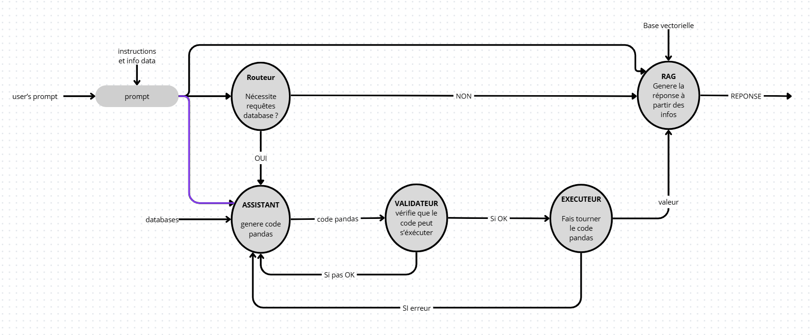

# hackathon_8INF934 - Mobility Copilot

## Quickstart

### Pré-requis


- Un environnement python avec les modules nécessaires au projet ``pip install -r requirements``
- OU pour une carte Nvidia utiliser le conteneur Docker ``docker compose up -d --build``

### Télécharger les données
Les API ne sont pas à jour, vous pouvez télécharger partiellement les données avec :
```bash
python3 ./download_datasets.py
python3 ./transform.py
```

Sinon vous pouvez utiliser rag.zip et raw.zip tous les deux à dézipper dans ./data/

### Lancement de l'interface utilisateur

```bash
streamlit run ./src/ui/app.py
```

## Architecture du projet


```text
src/
├── agent/
│   
│   ├── graph.py
│   ├── main.py
│   ├── nodes.py
│   ├── state.py
│   └── tests_poubelles/
│       ├── gemini.py
│       ├── ollama.py
│       └── test_question.py
        ├── api_groq.py
├── data_pipeline/
│   ├── ingestion.py
│   └── transform.py
├── reports/
│   ├── briefing.py
│   ├── formatter.py
│   ├── hotspots.py
│   ├── trends.py
│   └── weak_signals.py
└── ui/
    ├── app.py
    ├── question_example.wav
    ├── README_Sentence.md
    ├── sentence.py
    └── testSentence.py

```

### 1. Vue d'ensemble
Notre application est un assistant analytique "data-grounded" qui croise trois sources de données majeures de la Ville de Montréal :
- **Requêtes 311** (Nids-de-poule, déneigement, etc.)
- **Collisions routières** (Localisation, gravité, victimes)
- **Données météorologiques** (Températures, précipitations, neige)
- **Données stm** (Noms et emplacements station de métros)

L'architecture repose sur un **Agent RAG (Retrieval-Augmented Generation)** supervisé par un graphe d'états.

### 2. Organisation des Fichiers (`src/`)

### `agent/` (Cœur de l'IA)
C'est ici que réside l'intelligence du système.
- **`state.py`** : Définit l'état partagé (`AgentState`) qui circule entre les nœuds (historique des messages, code généré, erreurs, etc.).
- **`graph.py`** : Définit le flux de travail avec **LangGraph**. Le cycle est : 


- **`nodes.py`** : Contient la logique métier de chaque étape :
    - **Assistant** : Génère du code Python/Pandas via l'LLM (Groq/Llama 3.1).
    - **Validateur** : Vérifie que le code produit respecte les consignes de sécurité et de format.
    - **Exécuteur** : Lance réellement le code sur les DataFrames chargés en mémoire.
    - **RAG** : Génère la réponse à partir de toutes les informations. Analyse de manière critique les résultats et les confronte pour détecter d'éventuelles erreurs ou limites avant la réponse finale.
- **`api_groq.py` & `main.py`** : Points d'entrée pour l'initialisation de l'LLM, des moteurs de requête LlamaIndex (`PandasQueryEngine`) et des outils.

### `reports/` (Intelligence Analytique)
Modules spécialisés dans le traitement statistique lourd.
- **`hotspots.py`** : Identifie les zones critiques via un clustering spatial (**K-Means**) pour les collisions et des agrégations par arrondissement pour le 311.
- **`trends.py`** : Calcule les évolutions temporelles (YoY : Année sur Année, MoM : Mois sur Mois) et détecte les pics horaires.
- **`weak_signals.py`** : Détecte les **signaux faibles** via des régressions linéaires (croissance lente mais régulière) et des anomalies par **Z-score**.
- **`briefing.py`** : Agrège les résultats des modules précédents pour générer une synthèse hebdomadaire structurée.

### `data_pipeline/` (Gestion des données)
- **`ingestion.py`** : Chargement des fichiers CSV bruts.
- **`transform.py`** : Nettoyage, normalisation des types (dates, numérique) et préparation des jointures.

### `ui/` (Interface utilisateur)
- **`app.py`** : Application **Streamlit** offrant un tableau de bord interactif (Heatmaps, graphiques de tendances) et un chat avec l'agent.

### 3. Flux de Travail d'une Requête (Workflow)

1. **Input** : L'utilisateur pose une question (ex: "Impact de la neige sur les accidents").
2. **RAG / Planning** : L'agent consulte les descriptions des datasets (métadonnées) pour choisir les colonnes pertinentes.
3. **Génération de Code** : L'LLM produit un script Pandas effectuant la jointure et le filtrage.
4. **Validation** : Le système vérifie que le code n'est pas dangereux et qu'il stocke le résultat dans la variable attendue.
5. **Exécution** : Le code est exécuté sur les données réelles de Montréal.
6. **Génération** : Un deuxième appel LLM vérifie si le résultat semble cohérent ou s'il y a des risques d'interprétation.
7. **Output** : La réponse est affichée avec ses "preuves" (chiffres exacts).


### 3. Source Données

Données STM : https://www.stm.info/sites/default/files/gtfs/gtfs_stm.zip

Données collisions: https://donnees.montreal.ca/dataset/cd722e22-376b-4b89-9bc2-7c7ab317ef6b/resource/05deae93-d9fc-4acb-9779-e0942b5e962f/download/collisions_routieres.csv

Données météo : https://archive-api.open-meteo.com/v1/archive

Données 311 : téléchargé à la main depuis https://donnees.montreal.ca/dataset/requete-311

Rapport SPVM : https://spvm.qc.ca/fr/Pages/Decouvrir-le-SPVM/Lorganisation/Publications-et-statistiques/Rapports-dactivites-annuels